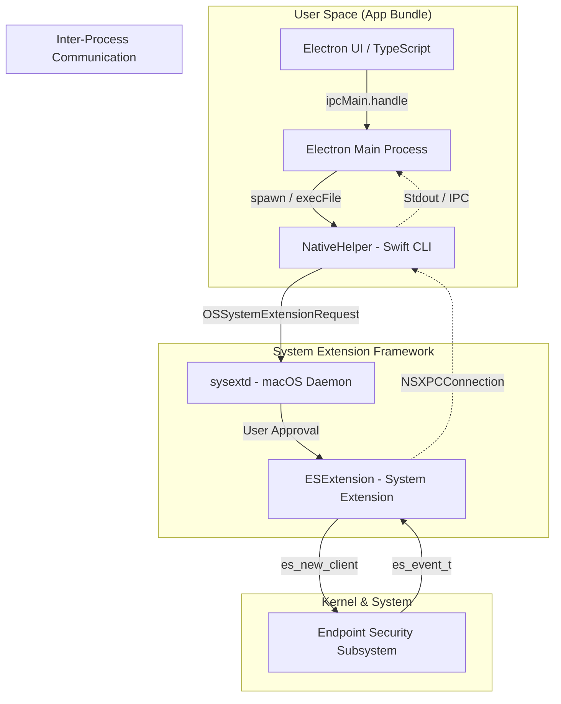

# Electron App + System Extension

# Project layout

```
my-es-project/
├── electron-ui/                # Electron app
│   ├── package.json
│   ├── main.js
│   ├── index.html
│   └── ...
├── ActiveHelper/          # Xcode project folder (Command Line Tool + System Extension target)
│   ├── ActiveHelper.xcodeproj 
│   ├── ActiveHelper/        # CLI: main.swift + files
│   └── EndpointSecurityExtension/   # extension code
└── build.sh                    # build script (no signing)
```

# Architecture


